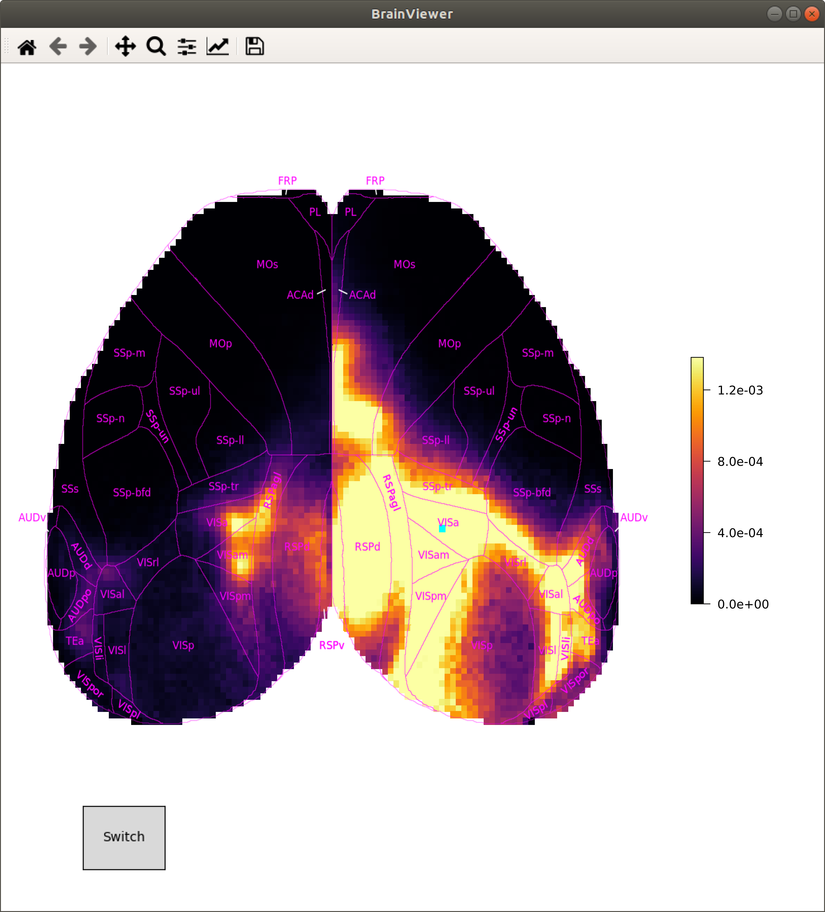

# brainviewer

BrainViewer is an interactive connectivity visualization tool using a high resolution cortical mouse connectome. Each injection and resulting projection can be viewed by clicking anywhere on the brain or using keyboard arrows to move about the brain. A blue voxel indicates the injection (clicked location) and the color defined by the colormap defines the projection at varying strengths. For additional information, including a description of the tool, visit https://arxiv.org/pdf/2205.02291.pdf.



Requirements include `allensdk` and `mcmodels` (https://github.com/AllenInstitute/allensdk, https://github.com/AllenInstitute/mouse_connectivity_models).

To run the interactive brainviewer, first run setup.py. This will preprocess the data.

## interactive_connectome.py
Module which runs real_time_plot.py or img_look_up.py based on user specification. The specification "-rt" refers to real_time_plot.py and "-pc" refers to img_look_up.py

Arguments:
- method: "-rt" or "-pc"
- testname: "topview" or "flatmap"
- verbosity: "-v 1" or "-v 2"

Example Invocation:
```
python3 interactive_connectome.py -pc flatmap -v 1
```

## real_time_plot.py
Module to display an interactive topview or flatmap view of the mouse brain. Upon clicking the mouse brain, the related projection is **computed** and diplayed.

Arguments:
- testname: "topview" or "flatmap"

Example Invocation:
```
python3 interactive_connectome.py flatmap
```


## img_look_up.py 
Module to display an interactive topview or flatmap view of the mouse brain. Upon clicking the mouse brain, the related projection is **loaded from a file** and diplayed. 

Arguments:
- testname: "topview" or "flatmap"

Example Invocation:
```
python3 interactive_connectome2.py flatmap
```


## Useful Modules

### connectome_img_generator.py
Module to create and download images for the flatmap and topview connectomes

Arguments:
- testname: "topview" or "flatmap"

Example Invocation:
```
python3 connectome_img_generator.py topview
```

```
...
├── src
│   ├── connectome_img_generator.py
│   └── generate_colorbar_fig.py
...
```
